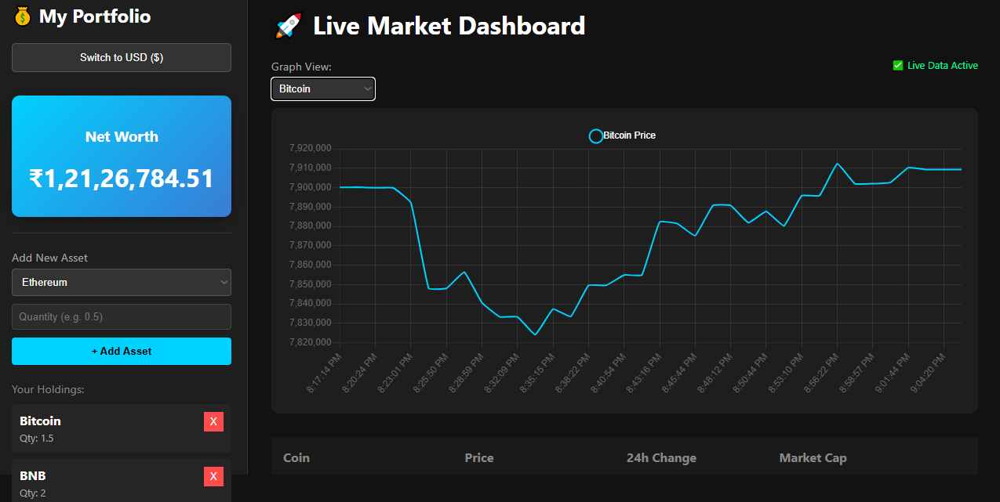
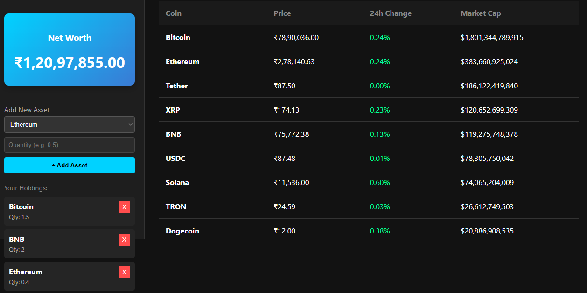

# Crypto Tracker

This is a high-performance, real-time cryptocurrency monitoring application built with Python (Flask) and Selenium. It serves as a comprehensive tool to track live market prices, manage personal portfolios, and visualize trends without relying on expensive APIs or manual page refreshes.

---

## Output Images




---

## Features

### Real-Time Monitoring
- Scrapes live data from CoinMarketCap every 60 seconds.
- Uses a persistent "headless" browser session to ensure updates happen in <2 seconds.

### Smart Portfolio Manager
- **Add/Remove Assets:** Dynamically manage your holdings (Bitcoin, Ethereum, etc.).
- **Net Worth Calculator:** Instantly calculates total portfolio value based on live prices.

### Interactive Visualization
- Professional-grade line charts using Chart.js.
- Features gradient fills, tooltips, and dynamic scaling.

### Localization
- **One-Click Currency Switcher:** Switch instantly between USD ($) and INR (₹).

### Modern UI
- A clean, dark-mode interface designed for readability and performance.

---

## Requirements

To run this project, you will need the following:

### System Requirements
- Python 3.7+
- Google Chrome (required for Selenium automation)

### Python Libraries
Install the libraries listed in `requirements.txt`:

- `Flask`
- `selenium`
- `webdriver-manager`
- `flask-cors`

You can install them with:

```bash
pip install Flask selenium webdriver-manager flask-cors
````

-----

## Setup and Installation

Follow these steps to run the application on your local machine.

### 1\. Install Dependencies

Ensure Python is installed and added to your PATH, then run:

```bash
pip install -r requirements.txt
```

*(Or use the direct `pip install` command listed in the Requirements section above.)*

### 2\. Configure Settings (Optional)

You may modify the following settings:

  - Refresh rate (default: 60 seconds)
  - Supported currencies
  - Chart update intervals

**Files to edit:**

  - `server.py`
  - `static/script.js`

### 3\. Run the Application

Start the backend server and scraper:

```bash
python server.py
```

*Note: The first run may take \~15 seconds to initialize Selenium.*

Open the dashboard in your browser:
**http://127.0.0.1:5000**

-----

## Testing

This project has been tested for stability and accuracy.

  * **Live Dashboard:** Displays top cryptocurrencies with current price, 24h change, and market cap.
  * **Currency Conversion:** Instantly toggles all prices and portfolio values between USD and INR.
  * **Portfolio Tracking:**
      * Users can add specific quantities (e.g., 0.5 BTC).
      * System correctly computes: `Net Worth = Quantity × Live Price`
  * **Charts:**
      * Auto-updating line charts every 60 seconds.
      * Smooth transitions and dynamic scaling.

-----

## 📁 Project Structure

```text
CryptoLiveApp/
├── crypto_tracker.py    # Background scraping logic (Selenium)
├── server.py            # Flask web server & thread manager
├── templates/
│   └── index.html       # Dashboard HTML structure
├── static/
│   ├── style.css        # Dark mode styling
│   └── script.js        # Frontend logic (Chart.js, API calls)
└── README.md
```

-----

## 📌 Known Limitations

1.  **Local Execution:** The scraper stops when your system sleeps or shuts down.
2.  **Dependency on CoinMarketCap:** If CoinMarketCap changes their HTML structure, the selectors in `crypto_tracker.py` may need updating.
3.  **Memory:** Chrome and Selenium together use \~300 MB RAM.

-----

## 👩‍💻 Author

**Vidhya Vinothkumar**
*vidhhya.2010@gmail.com*

---

```
